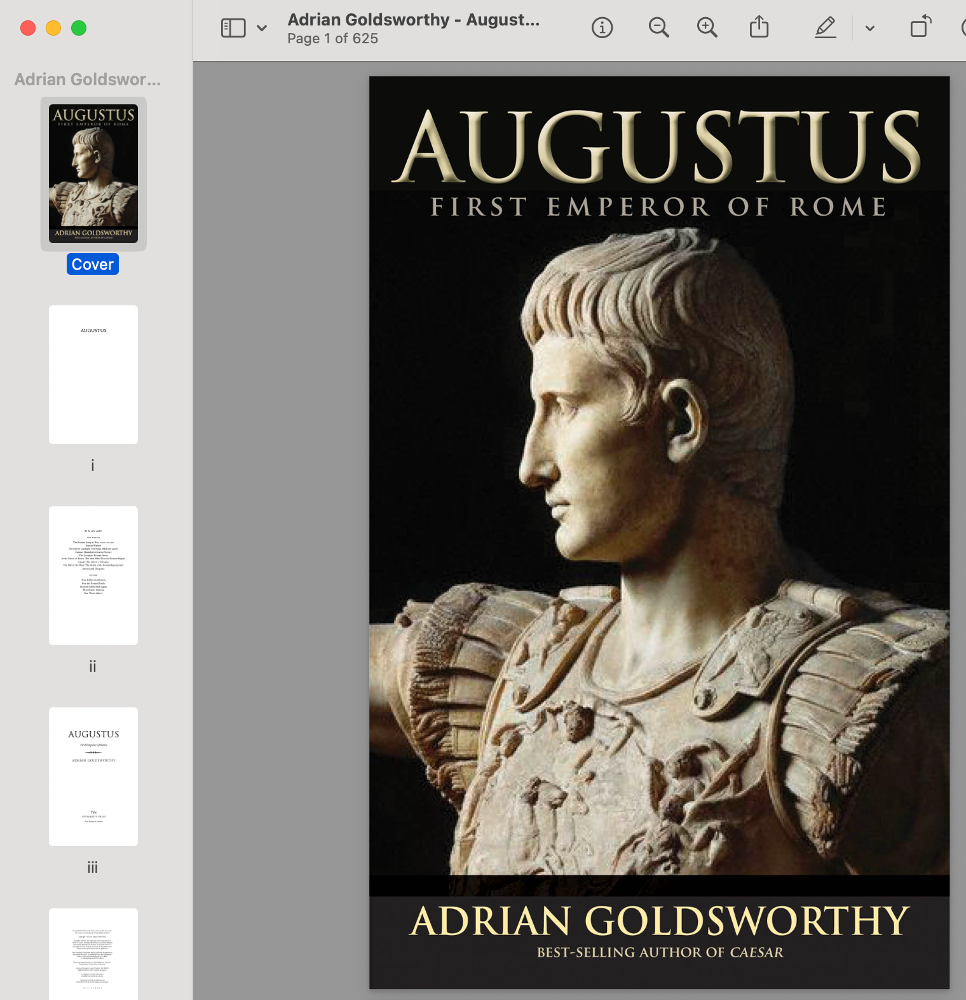
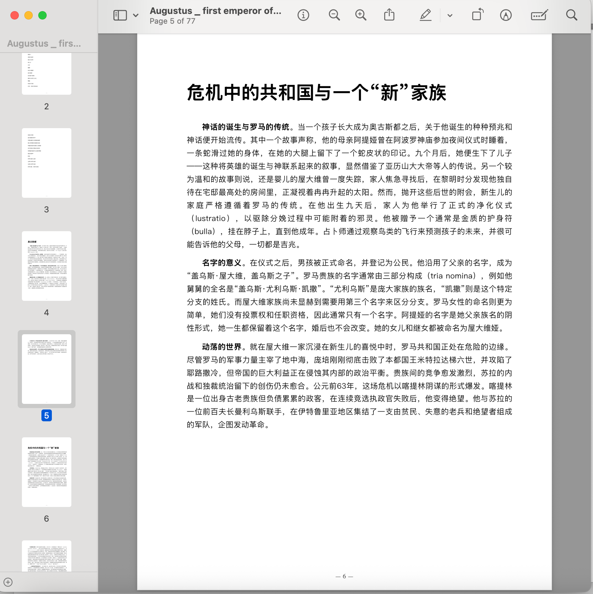
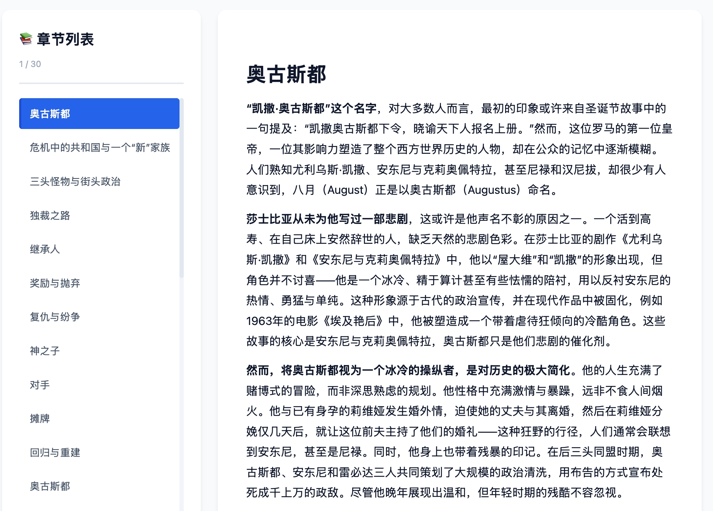
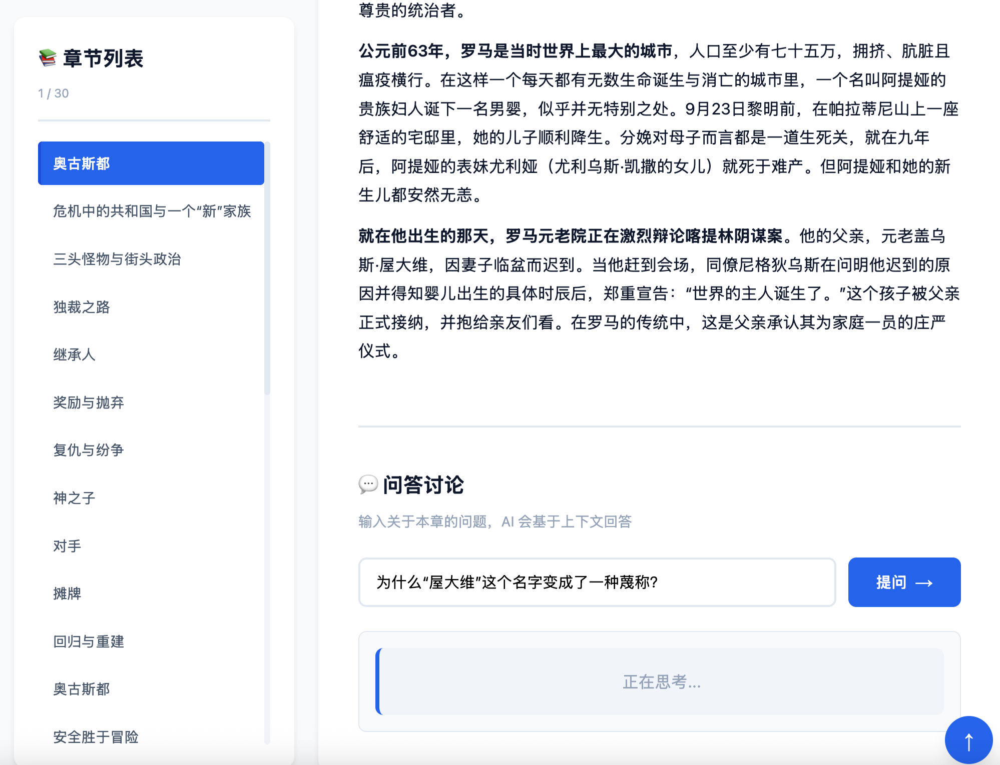
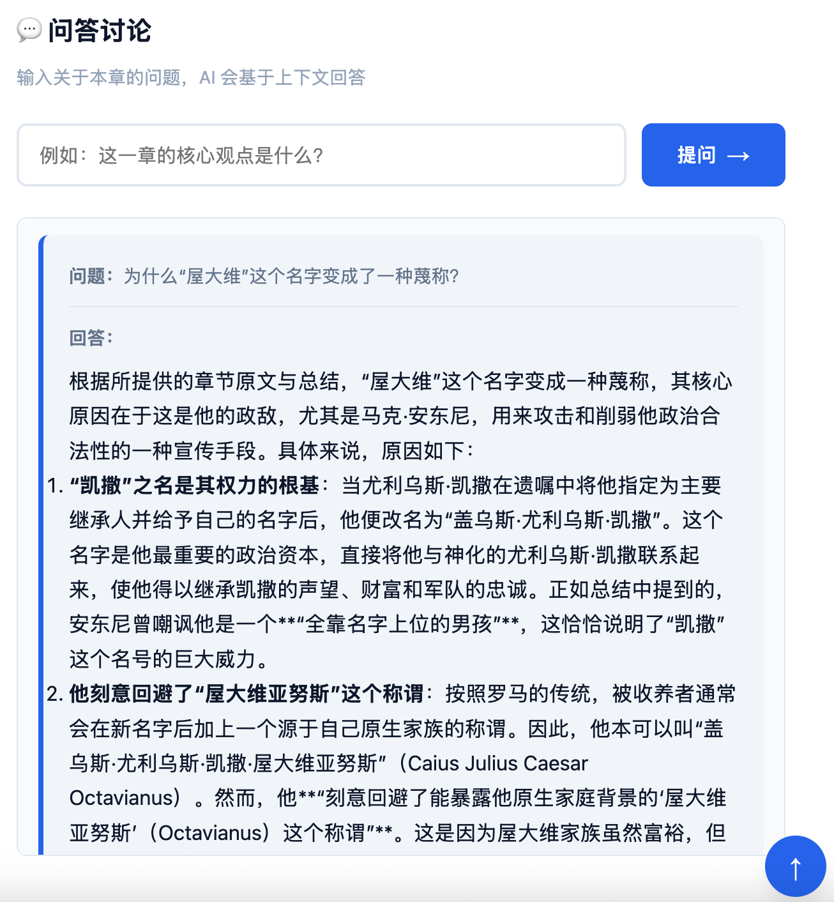
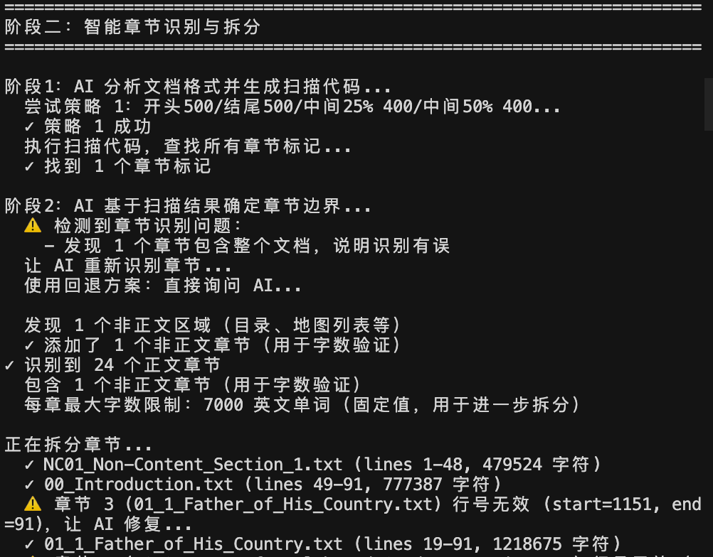
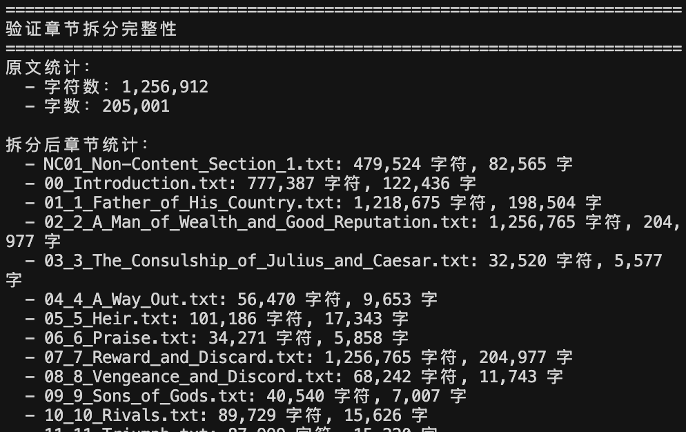
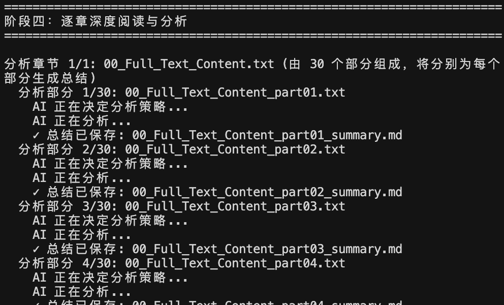

# Vibe Reading Skill


> **Vibe Reading — 在 AI 时代你真正要掌握的技能。**

**一个智能阅读分析 Agent Skill，帮助用户快速理解大部头著作的核心内容。**

---

## 📖 Vision: 在噪信时代重获深度

> **"好把旧书多读到，义言一出见英明。"**
>
> — 《推背图》

<br/>

> **"In the age of AI, output is cheap, but input is the real luxury."**

在这个 AIGC 爆发的时代，信息的生成成本已趋近于零。我们被海量的、由算法生成的"快餐内容"所包围，而在这些数字噪音之外，那些 **Pre-AIGC 时代** 的经典著作——那些凝结了人类真实智慧与逻辑的结晶，却因为我们要面对的"信息过载"而在此刻变得难以触及。

**Vibe Reading Skill** 的诞生，旨在解决这个时代的认知困境：**我们如何用有限的时间，去汲取无限的智慧？**

我们的目标不是替代阅读，而是**把书读薄**。

### 核心哲学

* **🛡️ 拒绝幻觉 (Zero Hallucination via Smart Chunking)**
    AI 常被诟病存在"幻觉"，但在知识获取中这是不可接受的。本 Skill 采用严谨的 **Smart Chunking（智能分块）** 技术，强制 AI 仅基于当前切片的原文进行分析。这就像给 AI 戴上了"脚镣"，让它不再是天马行空的"创作者"，而是脚踏实地的"分析师"。

* **💎 挖掘 Pre-AIGC 的智慧**
    真正的洞见往往深藏在大部头的长篇累牍中。通过 AI 的深度结构化分析，帮你过滤掉铺垫与冗余，直接提取出作者思想的骨架与核心逻辑，让"旧书"中的"义言"重见天日。

* **🗣️ 从"单向阅读"到"双向对话"**
    阅读不应是孤独的苦旅。通过生成的 **交互式 HTML**，你可以随时就书中不懂的观点向 AI 提问。当阅读遇到障碍时，它就是你身边那位博学且耐心的导读导师。

---

## ✨ 特性

- 📚 **智能章节识别**：AI 自动识别书籍结构，无需手动配置
- 🔄 **上下文连贯**：每章分析时参考前章总结，保持理解连贯
- 📄 **多格式输出**：Markdown、PDF（自动生成封面）、HTML 交互界面
- 🌍 **多语言支持**：自动识别和适配不同语言的书籍
- 🤖 **AI 驱动**：完全由 AI 决策，适应任何格式的书籍
- 🛡️ **智能重试机制**：自动处理 API 配额限制，遇到错误时自动重试（最多 5 次）
- 📖 **自动封面生成**：从文件名自动提取书名和作者，生成专业 PDF 封面

---

## 📸 功能展示

### 📄 PDF 总结 - 把书读薄

一键生成专业总结分析，如图所示：

<div align="center">
  
  <p><em>我最近在读奥古斯都传记，原书是个大部头的鸿篇巨著，有600页以上</em></p>
  
  
  <p><em>结构化分析后，干货总结为77页/em></p>
</div>

### 🌐 HTML 交互式阅读界面

通过交互式 HTML 界面，你可以：
- 📖 浏览章节列表，快速定位内容
- 💬 与 AI 进行问答对话，深入理解书中观点
- 🔍 基于上下文获取精准回答

<div align="center">
  
  <p><em>交互式阅读主界面</em></p>
  
  
  <p><em>章节阅读与导航</em></p>
  
  
  <p><em>AI 问答对话功能</em></p>
</div>

### 🤖 Agent Skill 运行过程

智能处理流程，从章节识别到深度分析：

<div align="center">
  
  <p><em>智能章节识别与拆分</em></p>
  
  
  <p><em>章节拆分完整性验证</em></p>
  
  
  <p><em>逐章深度阅读与分析</em></p>
</div>

---

## 快速开始

### 前置要求

- Python 3.8+
- Google Gemini API Key

### 安装

#### 方式一：作为 Python Package 安装（推荐）

```bash
# 从 GitHub 安装
pip install git+https://github.com/drbillwang/vibe-reading-skill-CN.git

# 或从本地安装（开发模式）
git clone https://github.com/drbillwang/vibe-reading-skill-CN.git
cd vibe-reading-skill-CN
pip install -e .
```

#### ⚠️ 重要：安装 PDF 生成依赖

**PDF 生成功能需要 Playwright 和浏览器支持。** 如果未安装，PDF 生成会被跳过，但其他功能（Markdown、HTML）仍可正常使用。

安装步骤：

```bash
# 1. 安装 playwright（如果通过 pip install 安装本包，playwright 应该已经包含在依赖中）
pip install playwright

# 2. 安装 Chromium 浏览器（这一步很重要！）
playwright install chromium
```

**注意**：
- 如果只运行了 `pip install playwright` 但没有运行 `playwright install chromium`，PDF 生成会失败
- 安装浏览器需要一些时间（约 100-200MB 下载）
- 如果不需要 PDF 功能，可以跳过此步骤，Markdown 和 HTML 输出不受影响

### 配置

创建 `.env` 文件：

```bash
GEMINI_API_KEY=your_api_key_here

# 可选：指定使用的模型（默认: gemini-2.5-pro）
# 推荐模型：
#   gemini-2.5-pro      - Gemini 2.5 旗舰模型（稳定可靠）⭐ 默认推荐
#   gemini-3-pro        - Gemini 3 旗舰模型（最新，最强性能）
#   gemini-3            - Gemini 3 标准模型
#   gemini-2.5-flash    - Gemini 2.5 快速模型（速度快，成本低）
#   gemini-1.5-pro      - 稳定版本（经过验证）
GEMINI_MODEL=gemini-2.5-pro

# 可选：代理配置（如果遇到 "User location is not supported" 错误）
# HTTP_PROXY=http://your_proxy_host:port
# HTTPS_PROXY=http://your_proxy_host:port
```

**模型选择**：
- `gemini-2.5-pro`（默认）：稳定可靠，适合高质量分析
- `gemini-2.5-flash`：速度快，成本低，适合快速处理或配额有限的情况
- `gemini-1.5-pro`：稳定版本，经过验证

**提示**：
- 如果遇到 API 配额限制（429 错误），可以：
  1. 切换到 `gemini-2.5-flash` 模型（配额限制更宽松）
  2. 等待一段时间后重试（系统会自动重试，最多 5 次，等待时间：60/90/120/150/180 秒）
- 如果遇到 "User location is not supported" 错误，需要配置代理（见下方代理配置）

### 使用

#### 基本使用：处理整本书

```python
from vibe_reading_skill_CN import process_book

result = process_book("your_book.epub")
print(result["status"])  # 'success' 或 'error'
```

#### 高级使用：从 summaries 目录生成 PDF

如果你已经有 summaries 目录，可以直接生成 PDF：

```python
from vibe_reading_skill_CN import generate_pdf_from_summaries
from pathlib import Path

# 从 summaries 目录生成 PDF（自动提取书名和作者）
generate_pdf_from_summaries(
    summaries_dir=Path("./summaries"),
    output_path=Path("./book_summary.pdf"),
    book_title="书籍标题",  # 可选，如果不提供会从文件名自动提取
    book_subtitle="副标题（可选）",
    book_author="作者名称（可选）",  # 可选，如果不提供会从文件名自动提取
    skip_files=['Front_Matter', 'Authors_Note'],  # 可选：跳过某些文件
    auto_extract_title=True,  # 默认 True，自动从文件名提取书名和作者
    include_all_md=False  # 默认 False，只处理 *_summary.md 文件
)
```

**封面生成**：
- 如果 `summaries/` 目录中存在 `00_Cover.md` 或 `00_Cover` 文件，会优先使用它作为封面
- 如果没有封面文件，会自动从输入文件名提取书名和作者，生成封面
- 封面会自动包含在生成的 PDF 中

## 工作流程

1. **文档预处理**：EPUB → TXT 转换（如需要）
2. **智能章节识别**：AI 自动识别章节结构（支持大文档的渐进式预览策略）
3. **进一步拆分**：AI 评估章节长度，必要时拆分
4. **逐章分析**：AI 深度阅读每章，生成总结（带智能重试机制）
5. **格式输出**：生成 Markdown、PDF（自动生成封面）、HTML

### 智能重试机制

当遇到 API 配额限制（429 错误）时，系统会：
- 自动检测错误类型
- 尝试从错误信息中提取建议的等待时间
- 如果没有建议时间，使用预定义的延迟序列：60 → 90 → 120 → 150 → 180 秒
- 每次遇到错误时，最多重试 5 次
- 每个 API 调用都有独立的重试机会

### 自动封面生成

PDF 生成时会自动：
- 从输入文件名提取书名和作者（支持 `书名 -- 作者` 或 `书名 - 作者` 格式）
- 如果没有封面文件，自动生成专业封面
- 如果存在 `00_Cover.md` 或 `00_Cover` 文件，优先使用它

## 输出目录

处理完成后会在当前目录创建以下输出目录：

- `chapters/` - 拆分好的章节原文
- `summaries/` - 章节总结（Markdown）
- `pdf/` - PDF 输出（需要安装 Playwright 和 Chromium，见上方安装说明）
- `html/` - HTML 交互界面

## 设计理念

本 Skill 采用 **AI 驱动，而非代码驱动** 的设计理念：

- ✅ **AI 负责所有决策**：章节识别、拆分策略、分析重点等都由 AI 根据具体情况判断
- ✅ **代码只做执行**：代码只负责执行 AI 的决策（文件读写、格式转换等）
- ✅ **智能错误处理**：AI 生成的代码如果执行失败，会让 AI 看到错误并重新生成，直到成功
- ✅ **渐进式预览**：处理大文档时，逐步减少预览内容，避免超过 token 限制
- ❌ **避免硬编码规则**：不预设"如果遇到 X 就做 Y"的规则

这使得 Skill 可以处理任何格式、任何语言的书籍，无需为每种新格式编写代码。

### 错误处理策略

1. **章节识别代码执行失败**：AI 会看到错误信息，分析问题并重新生成代码，最多重试 3 次
2. **API 配额限制**：自动重试，等待时间逐步增加（60/90/120/150/180 秒），最多 5 次
3. **大文档处理**：使用渐进式预览策略，逐步减少发送给 AI 的内容，直到成功

## 贡献

欢迎贡献！请提交 Issue 或 Pull Request。

## 许可证

Apache 2.0 License - 详见 [LICENSE](LICENSE)

## 作为 Skill 使用

本项目已配置为标准的 Python Skill，可以：

- ✅ 通过 `pip install` 安装
- ✅ 在 IDE 中直接调用

### Skill 调用示例

```python
from vibe_reading_skill_CN import process_book

# 基本调用
result = process_book("book.epub")

# 查看结果
if result["status"] == "success":
    print(f"处理完成！章节数: {result['metadata']['chapter_count']}")
    print(f"PDF: {result['output_paths']['pdf']}")
    print(f"HTML: {result['output_paths']['html']}")
else:
    print(f"错误: {result['message']}")
```

### 返回值格式

```python
{
    "status": "success",  # 或 "error"
    "message": "书籍处理完成",
    "output_paths": {
        "chapters": "chapters/",
        "summaries": "summaries/",
        "pdf": "pdf/book_summary.pdf",
        "html": "html/interactive_reader.html"
    },
    "metadata": {
        "book_title": "书籍标题",
        "chapter_count": 10,
        "processing_time": 123.45
    }
}
```

## 常见问题

### Q: 遇到 "User location is not supported" 错误怎么办？

A: 需要在 `.env` 文件中配置代理：
```bash
HTTP_PROXY=http://your_proxy_host:port
HTTPS_PROXY=http://your_proxy_host:port
```

### Q: PDF 生成失败，提示 "playwright 未安装"？

A: 需要完成两步安装：
1. `pip install playwright`
2. `playwright install chromium` ← 这一步很重要！

### Q: 遇到 API 配额限制（429 错误）？

A: 系统会自动重试（最多 5 次），也可以：
1. 切换到 `gemini-2.5-flash` 模型（配额限制更宽松）
2. 等待一段时间后重新运行

### Q: 如何自定义 PDF 封面？

A: 在 `summaries/` 目录中创建 `00_Cover.md` 文件，第一行是书名，后续行是其他信息（作者、日期等）

## 相关链接

- [Skill 指令](SKILL.md) - AI 处理指令
- [环境变量示例](env.example) - 完整的配置示例